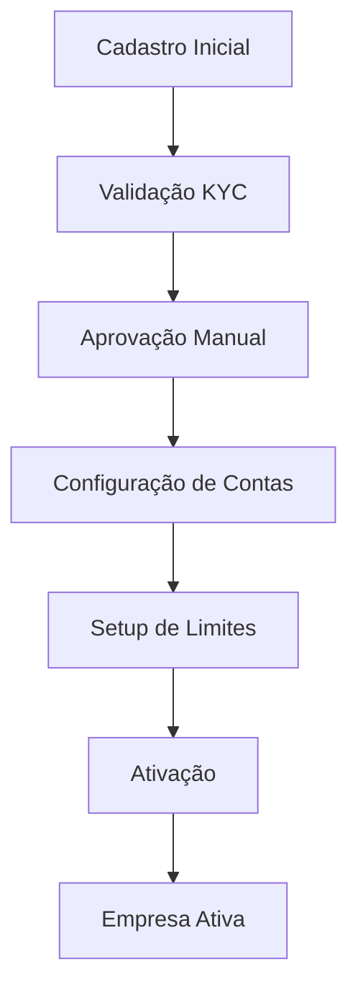
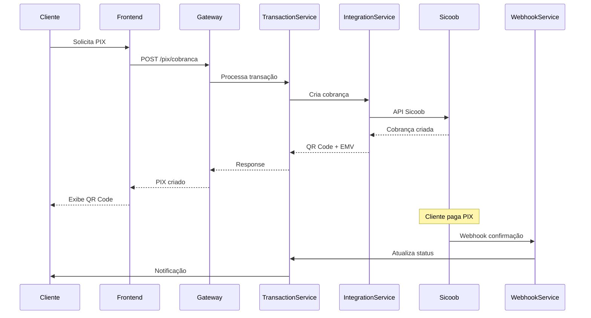
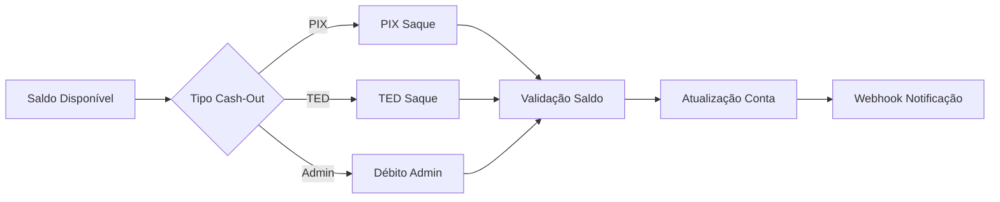
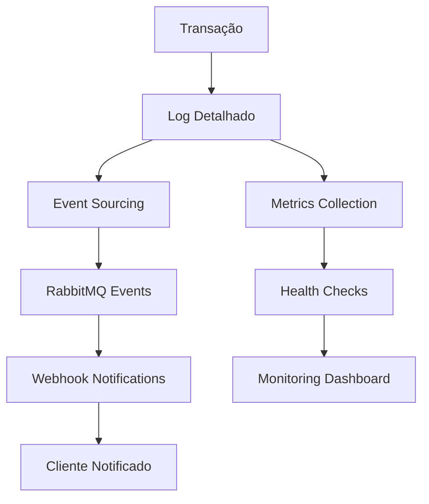

# 🏦 **FintechPSP - Guia Completo de Uso**

## 📋 **Visão Geral**

O **FintechPSP** é um sistema completo de PSP (Payment Service Provider) desenvolvido com arquitetura de microservices, oferecendo soluções para processamento de pagamentos PIX, TED, Boleto e Criptomoedas, com integração bancária completa e interfaces web para administração e internet banking.

---

## 🏗️ **Arquitetura do Sistema**

### **Backend - Microservices (.NET 9)**

| Serviço | Porta | Responsabilidade |
|---------|-------|------------------|
| **API Gateway** | 5000 | Roteamento, autenticação JWT, CORS |
| **AuthService** | 5001 | Autenticação OAuth 2.0, JWT tokens |
| **UserService** | 5006 | Gestão de usuários, contas bancárias |
| **TransactionService** | 5004 | Processamento PIX/TED/Boleto/Crypto |
| **BalanceService** | 5003 | Saldos, extratos, cash-out |
| **ConfigService** | 5007 | Configurações, taxas, roteamento |
| **WebhookService** | 5008 | Webhooks bancários, notificações |
| **IntegrationService** | 5005 | Integrações Sicoob, Stark Bank, etc. |
| **CompanyService** | 5010 | Gestão de empresas clientes |

### **Frontend - React/Next.js 15**

| Interface | Porta | Descrição |
|-----------|-------|-----------|
| **BackofficeWeb** | 3000 | Painel administrativo completo |
| **InternetBankingWeb** | 3001 | Portal do cliente para transações |

### **Infraestrutura - Docker**

| Serviço | Porta | Descrição |
|---------|-------|-----------|
| **PostgreSQL** | 5433 | Banco de dados principal |
| **RabbitMQ** | 5673 | Message bus para eventos |
| **Redis** | 6380 | Cache e sessões |

---

## 🚀 **Setup e Instalação**

### **Pré-requisitos**

- **Docker Desktop** (Windows/Mac/Linux)
- **.NET 9 SDK** 
- **Node.js 18+** e **npm**
- **Git**
- **PowerShell** (Windows) ou **Bash** (Linux/Mac)

### **1. Clone do Repositório**

```bash
git clone <repository-url>
cd fintech
```

### **2. Configuração da Infraestrutura**

```bash
# Iniciar containers Docker
cd docker
docker-compose up -d postgres rabbitmq redis

# Verificar se containers estão healthy
docker ps --format "table {{.Names}}\t{{.Status}}"
```

### **3. Configuração do Banco de Dados**

```bash
# Aguardar PostgreSQL inicializar
docker exec fintech-postgres pg_isready -U postgres

# Executar migrations (automático na primeira execução dos serviços)
```

### **4. Inicialização dos Microservices**

**PowerShell (Windows):**
```powershell
# AuthService
cd src/Services/FintechPSP.AuthService
$env:ASPNETCORE_URLS = "http://localhost:5001"
dotnet run --no-launch-profile

# BalanceService  
cd src/Services/FintechPSP.BalanceService
$env:ASPNETCORE_URLS = "http://localhost:5003"
dotnet run --no-launch-profile

# TransactionService
cd src/Services/FintechPSP.TransactionService
$env:ASPNETCORE_URLS = "http://localhost:5004"
dotnet run --no-launch-profile

# IntegrationService
cd src/Services/FintechPSP.IntegrationService
$env:ASPNETCORE_URLS = "http://localhost:5005"
dotnet run --no-launch-profile

# UserService
cd src/Services/FintechPSP.UserService
$env:ASPNETCORE_URLS = "http://localhost:5006"
dotnet run --no-launch-profile

# ConfigService
cd src/Services/FintechPSP.ConfigService
$env:ASPNETCORE_URLS = "http://localhost:5007"
dotnet run --no-launch-profile

# WebhookService
cd src/Services/FintechPSP.WebhookService
$env:ASPNETCORE_URLS = "http://localhost:5008"
dotnet run --no-launch-profile

# CompanyService
cd src/Services/FintechPSP.CompanyService
$env:ASPNETCORE_URLS = "http://localhost:5010"
dotnet run --no-launch-profile

# API Gateway (por último)
cd src/Gateway/FintechPSP.APIGateway
$env:ASPNETCORE_URLS = "http://localhost:5000"
dotnet run --no-launch-profile
```

### **5. Inicialização dos Frontends**

```bash
# BackofficeWeb
cd frontends/BackofficeWeb
npm install
npm run dev -- --port 3000

# InternetBankingWeb
cd frontends/InternetBankingWeb
npm install
npm run dev -- --port 3001
```

---

## 🔐 **Autenticação e Acesso**

### **Credenciais Padrão**

- **Email**: `admin@fintechpsp.com`
- **Senha**: `admin123`
- **Perfil**: Administrador Master

### **URLs de Acesso**

- **Backoffice**: http://localhost:3000
- **Internet Banking**: http://localhost:3001
- **API Gateway**: http://localhost:5000
- **Swagger APIs**: http://localhost:500X/swagger (onde X é o número do serviço)

---

## 💼 **Arquitetura de Negócio**

### **Fluxos Principais**

#### **1. Gestão de Empresas**
- **Cadastro**: Criação de empresas clientes
- **Aprovação**: Workflow de aprovação KYC
- **Configuração**: Setup de contas e limites

#### **2. Gestão de Usuários**
- **RBAC**: Controle de acesso baseado em roles
- **Contas Bancárias**: Vinculação de contas externas
- **Credenciais**: Gestão segura de tokens bancários

#### **3. Processamento de Transações**

**PIX:**
- Cobrança dinâmica com QR Code
- PIX Copia e Cola (EMV)
- Webhook de confirmação
- Integração Sicoob completa

**TED:**
- Transferências entre bancos
- Validação de dados bancários
- Agendamento de transferências

**Boleto:**
- Geração de boletos bancários
- Controle de vencimento
- Baixa automática

**Criptomoedas:**
- Suporte a múltiplas moedas
- Conversão automática
- Carteiras seguras

#### **4. Gestão de Saldos**
- **Consulta em tempo real**
- **Extratos detalhados**
- **Cash-out**: Saques PIX, TED, débito administrativo
- **Conciliação bancária**

#### **5. Integrações Bancárias**

**Sicoob (Produção):**
- PIX Recebimentos/Pagamentos
- Conta Corrente
- SPB Transferências
- Cobrança Bancária
- Open Finance

**Outros Bancos:**
- Stark Bank (Sandbox)
- Genial Investimentos
- Efí (ex-Gerencianet)
- Celcoin

---

## 🛠️ **Tecnologias Utilizadas**

### **Backend**
- **.NET 9** - Framework principal
- **PostgreSQL 15** - Banco de dados
- **Dapper** - ORM leve e performático
- **MassTransit + RabbitMQ** - Message bus
- **MediatR** - CQRS pattern
- **Ocelot** - API Gateway
- **JWT Bearer** - Autenticação
- **Swagger/OpenAPI** - Documentação

### **Frontend**
- **Next.js 15** - Framework React
- **React 19** - Biblioteca UI
- **TypeScript** - Tipagem estática
- **Tailwind CSS V4** - Estilização
- **Axios** - Cliente HTTP
- **React Hot Toast** - Notificações

### **DevOps**
- **Docker** - Containerização
- **Docker Compose** - Orquestração local
- **Health Checks** - Monitoramento
- **CORS** - Segurança web

---

## 📊 **Modelo de Dados**

### **Principais Entidades**

#### **Usuários e Autenticação**
- `system_users` - Usuários do sistema
- `oauth_clients` - Clientes OAuth 2.0
- `oauth_tokens` - Tokens de acesso

#### **Empresas e Clientes**
- `companies` - Empresas clientes
- `users` - Usuários finais
- `accounts` - Contas de saldo

#### **Transações**
- `transactions` - Transações principais
- `transaction_history` - Histórico detalhado
- `qr_codes` - QR Codes PIX

#### **Configurações**
- `bank_configs` - Configurações bancárias
- `routing_configs` - Roteamento de transações
- `fee_configs` - Configuração de taxas

#### **Integrações**
- `sicoob_pix_cobranca` - Cobranças PIX Sicoob
- `webhook_events` - Eventos de webhook
- `integration_logs` - Logs de integração

---

## 🔧 **Configurações Importantes**

### **Variáveis de Ambiente**

```bash
# Database
ConnectionStrings__DefaultConnection="Host=localhost;Port=5433;Database=fintech_psp;Username=postgres;Password=postgres"

# RabbitMQ
RabbitMQ__Host="localhost"
RabbitMQ__Port="5673"
RabbitMQ__Username="guest"
RabbitMQ__Password="guest"

# JWT
Jwt__SecretKey="mortadela-super-secret-key-that-should-be-at-least-256-bits-long-for-production"
Jwt__Issuer="Mortadela"
Jwt__Audience="Mortadela"
Jwt__ExpirationHours="1"

# Sicoob (Produção)
Sicoob__ClientId="your-client-id"
Sicoob__ClientSecret="your-client-secret"
Sicoob__CertificatePath="/path/to/certificate.p12"
Sicoob__CertificatePassword="cert-password"
```

### **Portas Utilizadas**

| Serviço | Porta | Protocolo |
|---------|-------|-----------|
| API Gateway | 5000 | HTTP |
| AuthService | 5001 | HTTP |
| TransactionService | 5004 | HTTP |
| IntegrationService | 5005 | HTTP |
| UserService | 5006 | HTTP |
| ConfigService | 5007 | HTTP |
| WebhookService | 5008 | HTTP |
| CompanyService | 5010 | HTTP |
| BackofficeWeb | 3000 | HTTP |
| InternetBankingWeb | 3001 | HTTP |
| PostgreSQL | 5433 | TCP |
| RabbitMQ | 5673 | AMQP |
| RabbitMQ Management | 15673 | HTTP |
| Redis | 6380 | TCP |

---

## 🧪 **Testes e Validação**

### **Health Checks**

```bash
# Verificar todos os serviços
curl http://localhost:5000/health  # API Gateway
curl http://localhost:5001/health  # AuthService
curl http://localhost:5003/test/health  # BalanceService
curl http://localhost:5004/health  # TransactionService
curl http://localhost:5005/health  # IntegrationService
curl http://localhost:5006/health  # UserService
curl http://localhost:5007/health  # ConfigService
curl http://localhost:5008/health  # WebhookService
curl http://localhost:5010/health  # CompanyService
```

### **Teste de Login**

```bash
# PowerShell
$body = '{"email":"admin@fintechpsp.com","password":"admin123"}'
$response = Invoke-RestMethod -Uri 'http://localhost:5001/auth/login' -Method POST -Body $body -ContentType 'application/json'
$token = $response.accessToken
Write-Host "Token: $($token.Substring(0,30))..."
```

### **Teste de Endpoints Banking**

```bash
# Com token obtido acima
$headers = @{'Authorization' = "Bearer $token"}
Invoke-RestMethod -Uri 'http://localhost:5000/banking/contas' -Headers $headers
Invoke-RestMethod -Uri 'http://localhost:5000/banking/transacoes/historico' -Headers $headers
```

---

## 📚 **Documentação Adicional**

- **Swagger APIs**: Disponível em cada microserviço na rota `/swagger`
- **Postman Collection**: `FintechPSP-Testes-Completos.json`
- **Guias Específicos**:
  - `TESTES-POSTMAN-PASSO-A-PASSO.md`
  - `POSTMAN-SCRIPTS-AVANCADOS.md`
  - `Documentacao/AuthService-ModeloDados.md`
  - `Documentacao/TransactionService-ModeloDados.md`
  - `Documentacao/IntegrationService-ModeloDados.md`

---

## 🔄 **Fluxos de Negócio Detalhados**

### **1. Onboarding de Empresa Cliente**



**Passos:**
1. **Cadastro**: Dados básicos (CNPJ, razão social, contatos)
2. **Documentação**: Upload de documentos obrigatórios
3. **Validação**: Verificação automática + manual
4. **Aprovação**: Decisão final do compliance
5. **Setup**: Configuração de contas e produtos
6. **Ativação**: Liberação para operação

### **2. Processamento PIX**



### **3. Gestão de Saldos e Cash-Out**



### **4. Integração Bancária**

**Sicoob (Produção):**
- **Autenticação**: OAuth 2.0 + mTLS
- **Endpoints**: 10+ APIs especializadas
- **Certificados**: Obrigatório para produção
- **Webhooks**: Confirmação automática

**Outros Bancos:**
- **Stark Bank**: Sandbox para testes
- **Genial**: Investimentos e conta
- **Efí**: PIX e boletos
- **Celcoin**: Múltiplos produtos

### **5. Monitoramento e Logs**



---

## 🎛️ **Interfaces de Usuário**

### **BackofficeWeb (Administração)**

**Módulos Principais:**
- **Dashboard**: Métricas e KPIs em tempo real
- **Empresas**: Gestão completa de clientes
- **Usuários**: CRUD e controle de acesso
- **Transações**: Histórico e relatórios
- **Configurações**: Taxas, limites, roteamento
- **Integrações**: Status e configuração bancária
- **Webhooks**: Gestão de notificações
- **Relatórios**: Financeiro e operacional

**Funcionalidades:**
- **Autenticação JWT** com refresh automático
- **RBAC** granular por módulo
- **Dark/Light Mode** responsivo
- **Exportação** de relatórios (PDF/Excel)
- **Notificações** em tempo real
- **Audit Trail** completo

### **InternetBankingWeb (Cliente)**

**Módulos Principais:**
- **Dashboard**: Saldo e últimas transações
- **PIX**: Envio, recebimento, QR Codes
- **TED**: Transferências bancárias
- **Boletos**: Geração e pagamento
- **Extratos**: Histórico detalhado
- **Configurações**: Dados pessoais e segurança

**Funcionalidades:**
- **Login seguro** com 2FA opcional
- **Transações** em tempo real
- **Comprovantes** digitais
- **Agendamentos** de pagamentos
- **Limites** personalizáveis
- **Suporte** integrado

---

## 🔒 **Segurança e Compliance**

### **Autenticação e Autorização**

**OAuth 2.0 Flows:**
- **Client Credentials**: Serviço para serviço
- **Authorization Code**: Usuários finais
- **JWT Tokens**: Stateless e seguros

**Scopes de Acesso:**
- `admin` - Administração completa
- `banking` - Operações bancárias
- `pix` - Transações PIX específicas
- `readonly` - Apenas leitura

### **Criptografia e Proteção**

**Dados em Trânsito:**
- **TLS 1.3** obrigatório
- **Certificate Pinning** para APIs críticas
- **HMAC** para webhooks

**Dados em Repouso:**
- **AES-256** para dados sensíveis
- **BCrypt** para senhas
- **Vault** para certificados

### **Compliance Bancário**

**Regulamentações:**
- **LGPD** - Lei Geral de Proteção de Dados
- **PCI DSS** - Segurança de cartões
- **BACEN** - Regulamentações do Banco Central
- **FEBRABAN** - Padrões bancários

**Auditoria:**
- **Logs imutáveis** de todas as operações
- **Trilha de auditoria** completa
- **Relatórios** de compliance automáticos
- **Backup** criptografado e versionado

---

## 📈 **Métricas e KPIs**

### **Operacionais**

- **TPS** (Transações por segundo)
- **Latência** média por endpoint
- **Uptime** dos serviços
- **Taxa de erro** por integração
- **Volume** de transações por tipo

### **Financeiros**

- **TPV** (Total Payment Volume)
- **Receita** por produto
- **Margem** por transação
- **Chargeback** rate
- **Conversão** de leads

### **Técnicos**

- **Response Time** por serviço
- **Memory Usage** dos containers
- **Database** performance
- **Queue** depth (RabbitMQ)
- **Cache** hit rate (Redis)

---

## 🚨 **Troubleshooting**

### **Problemas Comuns**

1. **Erro 502 Bad Gateway**
   - Verificar se todos os microservices estão rodando
   - Verificar configuração do Ocelot.json

2. **Erro de Conexão com Banco**
   - Verificar se PostgreSQL está healthy
   - Verificar string de conexão

3. **Erro de Autenticação**
   - Verificar se AuthService está rodando
   - Verificar credenciais padrão

4. **Frontend não carrega**
   - Verificar se npm install foi executado
   - Verificar se as portas 3000/3001 estão livres

### **Logs e Debug**

```bash
# Logs dos containers
docker logs fintech-postgres
docker logs fintech-rabbitmq
docker logs fintech-redis

# Verificar portas em uso
netstat -an | findstr "LISTENING" | findstr "500"
netstat -an | findstr "LISTENING" | findstr "300"
```

---

## 🚀 **Deployment e Produção**

### **Ambientes**

#### **Desenvolvimento (Local)**
```bash
# Configuração atual do guia
- Microservices: localhost:500X
- Frontends: localhost:300X
- Database: localhost:5433
- Message Bus: localhost:5673
```

#### **Staging**
```bash
# Configuração recomendada
- Load Balancer: NGINX/HAProxy
- Microservices: Kubernetes pods
- Database: PostgreSQL cluster
- Message Bus: RabbitMQ cluster
- Cache: Redis cluster
```

#### **Produção**
```bash
# Configuração enterprise
- CDN: CloudFlare/AWS CloudFront
- Load Balancer: AWS ALB/Azure Load Balancer
- Orchestration: Kubernetes/Docker Swarm
- Database: RDS/Azure Database
- Monitoring: Prometheus + Grafana
- Logging: ELK Stack
```

### **Docker Deployment**

#### **Build das Imagens**
```bash
# Backend services
docker build -t fintechpsp/auth-service:latest src/Services/FintechPSP.AuthService
docker build -t fintechpsp/transaction-service:latest src/Services/FintechPSP.TransactionService
docker build -t fintechpsp/balance-service:latest src/Services/FintechPSP.BalanceService
docker build -t fintechpsp/integration-service:latest src/Services/FintechPSP.IntegrationService
docker build -t fintechpsp/user-service:latest src/Services/FintechPSP.UserService
docker build -t fintechpsp/config-service:latest src/Services/FintechPSP.ConfigService
docker build -t fintechpsp/webhook-service:latest src/Services/FintechPSP.WebhookService
docker build -t fintechpsp/company-service:latest src/Services/FintechPSP.CompanyService
docker build -t fintechpsp/api-gateway:latest src/Gateway/FintechPSP.APIGateway

# Frontend applications
docker build -t fintechpsp/backoffice-web:latest frontends/BackofficeWeb
docker build -t fintechpsp/internetbanking-web:latest frontends/InternetBankingWeb
```

#### **Docker Compose Produção**
```yaml
# docker-compose.prod.yml
version: '3.8'
services:
  # Load Balancer
  nginx:
    image: nginx:alpine
    ports:
      - "80:80"
      - "443:443"
    volumes:
      - ./nginx.conf:/etc/nginx/nginx.conf
      - ./ssl:/etc/ssl/certs
    depends_on:
      - api-gateway
      - backoffice-web
      - internetbanking-web

  # API Gateway
  api-gateway:
    image: fintechpsp/api-gateway:latest
    environment:
      - ASPNETCORE_ENVIRONMENT=Production
      - ConnectionStrings__DefaultConnection=${DB_CONNECTION_STRING}
    deploy:
      replicas: 3
      resources:
        limits:
          memory: 512M
        reservations:
          memory: 256M

  # Microservices (similar configuration for each)
  auth-service:
    image: fintechpsp/auth-service:latest
    environment:
      - ASPNETCORE_ENVIRONMENT=Production
    deploy:
      replicas: 2

  # Database (external managed service recommended)
  postgres:
    image: postgres:15-alpine
    environment:
      - POSTGRES_DB=${DB_NAME}
      - POSTGRES_USER=${DB_USER}
      - POSTGRES_PASSWORD=${DB_PASSWORD}
    volumes:
      - postgres_data:/var/lib/postgresql/data
    deploy:
      replicas: 1
      placement:
        constraints:
          - node.role == manager
```

### **Kubernetes Deployment**

#### **Namespace e ConfigMaps**
```yaml
# namespace.yaml
apiVersion: v1
kind: Namespace
metadata:
  name: fintechpsp

---
# configmap.yaml
apiVersion: v1
kind: ConfigMap
metadata:
  name: fintechpsp-config
  namespace: fintechpsp
data:
  ASPNETCORE_ENVIRONMENT: "Production"
  Jwt__Issuer: "FintechPSP"
  Jwt__Audience: "FintechPSP"
```

#### **Deployments**
```yaml
# auth-service-deployment.yaml
apiVersion: apps/v1
kind: Deployment
metadata:
  name: auth-service
  namespace: fintechpsp
spec:
  replicas: 3
  selector:
    matchLabels:
      app: auth-service
  template:
    metadata:
      labels:
        app: auth-service
    spec:
      containers:
      - name: auth-service
        image: fintechpsp/auth-service:latest
        ports:
        - containerPort: 8080
        env:
        - name: ConnectionStrings__DefaultConnection
          valueFrom:
            secretKeyRef:
              name: database-secret
              key: connection-string
        resources:
          requests:
            memory: "256Mi"
            cpu: "250m"
          limits:
            memory: "512Mi"
            cpu: "500m"
        livenessProbe:
          httpGet:
            path: /health
            port: 8080
          initialDelaySeconds: 30
          periodSeconds: 10
        readinessProbe:
          httpGet:
            path: /health
            port: 8080
          initialDelaySeconds: 5
          periodSeconds: 5

---
# auth-service-service.yaml
apiVersion: v1
kind: Service
metadata:
  name: auth-service
  namespace: fintechpsp
spec:
  selector:
    app: auth-service
  ports:
  - port: 80
    targetPort: 8080
  type: ClusterIP
```

### **Monitoramento e Observabilidade**

#### **Prometheus + Grafana**
```yaml
# monitoring-stack.yaml
apiVersion: v1
kind: ConfigMap
metadata:
  name: prometheus-config
data:
  prometheus.yml: |
    global:
      scrape_interval: 15s
    scrape_configs:
    - job_name: 'fintechpsp-services'
      kubernetes_sd_configs:
      - role: pod
        namespaces:
          names:
          - fintechpsp
      relabel_configs:
      - source_labels: [__meta_kubernetes_pod_annotation_prometheus_io_scrape]
        action: keep
        regex: true
```

#### **Logging com ELK Stack**
```yaml
# filebeat-config.yaml
apiVersion: v1
kind: ConfigMap
metadata:
  name: filebeat-config
data:
  filebeat.yml: |
    filebeat.inputs:
    - type: container
      paths:
        - /var/log/containers/*fintechpsp*.log
    output.elasticsearch:
      hosts: ["elasticsearch:9200"]
    setup.kibana:
      host: "kibana:5601"
```

### **Segurança em Produção**

#### **Secrets Management**
```yaml
# secrets.yaml
apiVersion: v1
kind: Secret
metadata:
  name: database-secret
  namespace: fintechpsp
type: Opaque
data:
  connection-string: <base64-encoded-connection-string>
  jwt-secret: <base64-encoded-jwt-secret>
  sicoob-client-secret: <base64-encoded-sicoob-secret>
```

#### **Network Policies**
```yaml
# network-policy.yaml
apiVersion: networking.k8s.io/v1
kind: NetworkPolicy
metadata:
  name: fintechpsp-network-policy
  namespace: fintechpsp
spec:
  podSelector: {}
  policyTypes:
  - Ingress
  - Egress
  ingress:
  - from:
    - namespaceSelector:
        matchLabels:
          name: fintechpsp
  egress:
  - to:
    - namespaceSelector:
        matchLabels:
          name: fintechpsp
  - to: []
    ports:
    - protocol: TCP
      port: 443
    - protocol: TCP
      port: 53
    - protocol: UDP
      port: 53
```

### **CI/CD Pipeline**

#### **GitHub Actions**
```yaml
# .github/workflows/deploy.yml
name: Deploy FintechPSP
on:
  push:
    branches: [main]

jobs:
  build-and-deploy:
    runs-on: ubuntu-latest
    steps:
    - uses: actions/checkout@v3

    - name: Setup .NET
      uses: actions/setup-dotnet@v3
      with:
        dotnet-version: '9.0.x'

    - name: Build and Test
      run: |
        dotnet restore
        dotnet build --no-restore
        dotnet test --no-build --verbosity normal

    - name: Build Docker Images
      run: |
        docker build -t ${{ secrets.REGISTRY }}/auth-service:${{ github.sha }} src/Services/FintechPSP.AuthService
        docker build -t ${{ secrets.REGISTRY }}/transaction-service:${{ github.sha }} src/Services/FintechPSP.TransactionService

    - name: Push to Registry
      run: |
        echo ${{ secrets.REGISTRY_PASSWORD }} | docker login ${{ secrets.REGISTRY }} -u ${{ secrets.REGISTRY_USERNAME }} --password-stdin
        docker push ${{ secrets.REGISTRY }}/auth-service:${{ github.sha }}
        docker push ${{ secrets.REGISTRY }}/transaction-service:${{ github.sha }}

    - name: Deploy to Kubernetes
      run: |
        kubectl set image deployment/auth-service auth-service=${{ secrets.REGISTRY }}/auth-service:${{ github.sha }} -n fintechpsp
        kubectl set image deployment/transaction-service transaction-service=${{ secrets.REGISTRY }}/transaction-service:${{ github.sha }} -n fintechpsp
```

### **Backup e Disaster Recovery**

#### **Database Backup**
```bash
# Backup automático PostgreSQL
#!/bin/bash
BACKUP_DIR="/backups/fintechpsp"
DATE=$(date +%Y%m%d_%H%M%S)
BACKUP_FILE="fintechpsp_backup_$DATE.sql"

# Criar backup
pg_dump -h $DB_HOST -U $DB_USER -d $DB_NAME > $BACKUP_DIR/$BACKUP_FILE

# Comprimir
gzip $BACKUP_DIR/$BACKUP_FILE

# Upload para S3
aws s3 cp $BACKUP_DIR/$BACKUP_FILE.gz s3://fintechpsp-backups/

# Limpar backups antigos (manter 30 dias)
find $BACKUP_DIR -name "*.gz" -mtime +30 -delete
```

#### **Disaster Recovery Plan**
1. **RTO** (Recovery Time Objective): 4 horas
2. **RPO** (Recovery Point Objective): 1 hora
3. **Backup Strategy**: Diário completo + incremental a cada hora
4. **Multi-Region**: Replicação em 2 regiões
5. **Failover**: Automático com health checks

---

## 🎯 **Próximos Passos**

1. **Configurar certificados Sicoob** para produção
2. **Implementar monitoramento** com Prometheus/Grafana
3. **Configurar CI/CD** pipeline
4. **Implementar testes automatizados**
5. **Configurar backup** automático do banco
6. **Implementar rate limiting** no API Gateway
7. **Configurar SSL/TLS** para produção

---

**🏆 Sistema FintechPSP - Solução completa para Payment Service Provider!** 🚀
