# 🏦 TRILHA INTEGRADA PSP-SICOOB
## Fluxo Completo: Do Cadastro ao Extrato

> **Ambiente**: Produção Sicoob (configurado)  
> **Cliente Teste**: EmpresaTeste Ltda (CNPJ: 12.345.678/0001-99)  
> **Usuário**: cliente@empresateste.com  
> **Conta**: Sicoob (756) - Conta Corrente  

---

## 📋 **ETAPA 1: CADASTRO DO CLIENTE (EMPRESA)**

### **🎯 Objetivo**
Cadastrar empresa no BackofficeWeb com validação via API Sicoob e aprovação manual.

### **🔧 Ações Detalhadas**

#### **1.1 Acesso ao BackofficeWeb**
```
URL: http://localhost:3000 (BackofficeWeb)
Login: admin@fintech.com
Senha: admin123
Role: ADMIN
```

#### **1.2 Navegação para Cadastro**
- **Tela**: Dashboard Admin → Menu "Empresas" → "Nova Empresa"
- **Endpoint Frontend**: `/admin/empresas`
- **Componente**: `frontends/BackofficeWeb/src/app/(admin)/empresas/page.tsx`

#### **1.3 Preenchimento dos Dados**
```json
{
  "razaoSocial": "EmpresaTeste Ltda",
  "nomeFantasia": "EmpresaTeste",
  "cnpj": "12.345.678/0001-99",
  "inscricaoEstadual": "123456789",
  "inscricaoMunicipal": "987654321",
  "address": {
    "street": "Rua Teste, 123",
    "city": "São Paulo",
    "state": "SP",
    "zipCode": "01234-567",
    "country": "Brasil"
  },
  "telefone": "(11) 99999-9999",
  "email": "contato@empresateste.com",
  "website": "https://empresateste.com",
  "observacoes": "Cliente teste para integração Sicoob"
}
```

#### **1.4 Integração com API Sicoob**
**Chamada API**: Validação CNPJ
```http
POST /integrations/sicoob/validacao/cnpj
Content-Type: application/json
Authorization: Bearer {sicoob-token}

{
  "cnpj": "12345678000199"
}
```

**Endpoint Interno**:
```http
POST http://localhost:5004/companies
Content-Type: application/json
Authorization: Bearer {jwt-token}

{dados da empresa}
```

**Service**: `CompanyService.CreateAsync()`
**Repository**: `CompanyRepository.CreateAsync()`
**Database**: Tabela `companies` (PostgreSQL)

#### **1.5 Logs Esperados**
```log
[INFO] CompanyController: Criando nova empresa - CNPJ: 12345678000199
[INFO] SicoobValidationService: Validando CNPJ no Sicoob
[INFO] CompanyRepository: Empresa criada com ID: {guid}
[INFO] EventPublisher: Evento EmpresaCriada publicado
```

### **🔍 Verificações**

#### **✅ Validações Técnicas**
- [ ] Empresa salva no banco de dados
- [ ] Status inicial: `PendingDocuments`
- [ ] CNPJ validado via Sicoob
- [ ] Evento `EmpresaCriada` publicado no RabbitMQ
- [ ] Logs de auditoria gerados

#### **🖥️ Reflexões nas Telas**

**BackofficeWeb (Visão do Banco)**:
- Lista de empresas mostra "EmpresaTeste Ltda"
- Status: "Pendente Documentação"
- Botão "Aprovar" disponível
- Histórico de ações registrado

**InternetBankingWeb (Visão do Cliente)**:
- Cliente ainda não tem acesso
- Tela de login não permite entrada

### **🔗 Conexão com Próxima Etapa**
✅ **Esta etapa habilita a Etapa 2 (Geração de Usuário) porque:**
- Empresa está cadastrada no sistema
- ID da empresa disponível para vinculação de usuários
- Status permite criação de usuário administrativo
- Dados validados pelo Sicoob garantem integridade

---

## 📋 **ETAPA 2: GERAÇÃO DE USUÁRIO PARA O CLIENTE**

### **🎯 Objetivo**
Criar usuário vinculado à empresa com acesso ao InternetBankingWeb.

### **🔧 Ações Detalhadas**

#### **2.1 Aprovação da Empresa (Pré-requisito)**
**BackofficeWeb**: 
- Navegar para detalhes da empresa
- Clicar em "Aprovar Empresa"
- Status muda para `Approved`

**API Call**:
```http
PUT http://localhost:5004/companies/{companyId}/status
Content-Type: application/json

{
  "status": "Approved",
  "approvedBy": "admin@fintech.com",
  "approvalNotes": "Documentação validada"
}
```

#### **2.2 Criação do Usuário**
**BackofficeWeb**: Empresas → Detalhes → "Criar Usuário"

**Dados do Usuário**:
```json
{
  "email": "cliente@empresateste.com",
  "name": "Gerente EmpresaTeste",
  "role": "COMPANY_ADMIN",
  "companyId": "{company-guid}",
  "permissions": [
    "VIEW_ACCOUNTS",
    "CREATE_TRANSACTIONS",
    "VIEW_STATEMENTS",
    "MANAGE_USERS"
  ]
}
```

**API Call**:
```http
POST http://localhost:5003/users
Content-Type: application/json

{dados do usuário}
```

#### **2.3 Envio de Convite**
**Service**: `UserService.SendInvitation()`
**Email**: Convite com link de ativação
**Template**: "Bem-vindo ao FintechPSP"

### **🔍 Verificações**

#### **✅ Validações Técnicas**
- [ ] Usuário criado na tabela `users`
- [ ] Vinculação empresa-usuário na tabela `user_companies`
- [ ] Email de convite enviado
- [ ] Token de ativação gerado
- [ ] Evento `UsuarioCriado` publicado

#### **🖥️ Reflexões nas Telas**

**BackofficeWeb**:
- Detalhes da empresa mostram usuário vinculado
- Status do usuário: "Convite Enviado"
- Histórico de ações atualizado

**InternetBankingWeb**:
- Tela de ativação disponível via link do email
- Após ativação: login habilitado
- Dashboard inicial vazio (sem contas ainda)

### **🔗 Conexão com Próxima Etapa**
✅ **Esta etapa habilita a Etapa 3 (Configuração Inicial) porque:**
- Usuário tem acesso ao sistema
- Permissões de administrador da empresa
- Pode configurar limites e integrações
- Interface InternetBankingWeb acessível

---

## 📋 **ETAPA 3: CONFIGURAÇÃO INICIAL**

### **🎯 Objetivo**
Definir limites, RBAC e configurações de integração Sicoob.

### **🔧 Ações Detalhadas**

#### **3.1 Login do Cliente**
```
URL: http://localhost:3001 (InternetBankingWeb)
Email: cliente@empresateste.com
Senha: {definida na ativação}
```

#### **3.2 Configuração de Limites**
**Tela**: Dashboard → Configurações → Limites de Transação

**Limites Definidos**:
```json
{
  "dailyLimits": {
    "pix": 10000.00,
    "ted": 50000.00,
    "boleto": 25000.00
  },
  "monthlyLimits": {
    "pix": 100000.00,
    "ted": 500000.00,
    "boleto": 250000.00
  },
  "transactionLimits": {
    "pixMax": 5000.00,
    "tedMax": 100000.00,
    "boletoMax": 50000.00
  }
}
```

**API Call**:
```http
POST http://localhost:5006/config/limits
Content-Type: application/json
Authorization: Bearer {user-jwt}

{limites}
```

#### **3.3 Configuração Sicoob OAuth**
**Tela**: Configurações → Integrações → Sicoob

**Dados de Configuração**:
```json
{
  "bankCode": "756",
  "clientId": "dd533251-7a11-4939-8713-016763653f3c",
  "certificatePath": "configured",
  "scopes": [
    "pix.read",
    "pix.write",
    "cob.read",
    "cob.write",
    "cco_saldo",
    "cco_extrato"
  ],
  "endpoints": {
    "pixRecebimentos": "https://api.sicoob.com.br/pix/api/v2",
    "contaCorrente": "https://api.sicoob.com.br/conta-corrente/v4"
  }
}
```

#### **3.4 Teste de Conectividade**
**API Call**:
```http
GET http://localhost:5005/integrations/sicoob/test-connectivity
Authorization: Bearer {user-jwt}
```

**Resposta Esperada**:
```json
{
  "status": "success",
  "tests": [
    {
      "name": "OAuth Authentication",
      "success": true,
      "message": "Token obtido com sucesso"
    },
    {
      "name": "PIX API Access",
      "success": true,
      "message": "Acesso autorizado"
    }
  ]
}
```

### **🔍 Verificações**

#### **✅ Validações Técnicas**
- [ ] Configurações salvas no `ConfigService`
- [ ] Token OAuth Sicoob válido
- [ ] Certificado mTLS funcionando
- [ ] Ping APIs Sicoob bem-sucedido
- [ ] Logs de conectividade OK

#### **🖥️ Reflexões nas Telas**

**InternetBankingWeb**:
- Tela de configurações mostra status "Conectado"
- Limites definidos e salvos
- Indicador verde para integração Sicoob

**BackofficeWeb**:
- Empresa mostra status "Configurada"
- Limites aprovados automaticamente
- Logs de integração disponíveis

### **🔗 Conexão com Próxima Etapa**
✅ **Esta etapa habilita a Etapa 4 (Criação de Conta) porque:**
- Limites de transação definidos
- Integração Sicoob configurada e testada
- Usuário tem permissões necessárias
- Sistema pronto para operações bancárias

---

## 📋 **ETAPA 4: CRIAÇÃO E ATIVAÇÃO DE CONTA**

### **🎯 Objetivo**
Criar conta corrente e registrar no Sicoob via API.

### **🔧 Ações Detalhadas**

#### **4.1 Solicitação de Conta**
**InternetBankingWeb**: Dashboard → Contas → "Nova Conta Corrente"

**Dados da Conta**:
```json
{
  "accountType": "CHECKING",
  "bankCode": "756",
  "initialBalance": 0.00,
  "description": "Conta Corrente Principal",
  "currency": "BRL"
}
```

**API Call**:
```http
POST http://localhost:5003/accounts
Content-Type: application/json
Authorization: Bearer {user-jwt}

{dados da conta}
```

#### **4.2 Workflow de Aprovação**
**BackofficeWeb**: Contas → Pendentes → "Aprovar Conta"

**Processo**:
1. Análise automática de limites
2. Verificação de documentação
3. Aprovação manual pelo admin
4. Ativação da conta

#### **4.3 Registro no Sicoob**
**Integração Automática** (após aprovação):

**API Call Sicoob**:
```http
POST https://api.sicoob.com.br/conta-corrente/v4/contas
Content-Type: application/json
Authorization: Bearer {sicoob-token}
Certificate: {mtls-cert}

{
  "numeroCliente": "25546454",
  "tipoConta": "CORRENTE",
  "moeda": "BRL",
  "saldoInicial": 0.00
}
```

**Service**: `IntegrationService.RegisterAccountSicoob()`

### **🔍 Verificações**

#### **✅ Validações Técnicas**
- [ ] Conta criada na tabela `accounts`
- [ ] Status: `ACTIVE`
- [ ] Conta virtual registrada no Sicoob
- [ ] Saldo inicial: R$ 0,00
- [ ] Evento `ContaCriada` publicado

#### **🖥️ Reflexões nas Telas**

**InternetBankingWeb**:
- Lista de contas mostra nova conta
- Saldo: R$ 0,00
- Status: "Ativa"
- Opções de transação habilitadas

**BackofficeWeb**:
- Conta aparece na lista de contas ativas
- Vinculação empresa-conta visível
- Logs de criação no Sicoob

### **🔗 Conexão com Próxima Etapa**
✅ **Esta etapa habilita a Etapa 5 (Transações PIX) porque:**
- Conta corrente ativa e operacional
- Integração Sicoob estabelecida
- Saldo disponível para movimentação
- Limites de transação configurados

---

## 📋 **ETAPA 5: REALIZAÇÃO DE TRANSAÇÕES PIX**

### **🎯 Objetivo**
Realizar transações PIX com integração Sicoob completa.

### **🔧 Ações Detalhadas**

#### **5.1 Criação de QR Code Dinâmico**
**InternetBankingWeb**: Transações → PIX → "Receber PIX"

**Dados da Cobrança**:
```json
{
  "amount": 100.00,
  "pixKey": "a59b3ad1-c78a-4382-9216-01376298b153",
  "description": "Teste integração Sicoob",
  "expiresIn": 3600
}
```

**API Calls Sequenciais**:
1. **TransactionService**: Criar QR Code
```http
POST http://localhost:5002/transacoes/pix/qrcode/dinamico
```

2. **IntegrationService**: Criar cobrança Sicoob
```http
POST http://localhost:5005/integrations/sicoob/pix/cobranca
```

3. **Sicoob API**: Registrar cobrança
```http
POST https://api.sicoob.com.br/pix/api/v2/cob
```

#### **5.2 Fluxo de Integração Completo**

**Sequência de Eventos**:
1. `QrCodeGerado` → TransactionService
2. `PixIniciado` → IntegrationService (via RabbitMQ)
3. `CobrancaCriada` → Sicoob API
4. `QrCodeAtualizado` → TransactionService
5. `TransacaoProcessando` → BalanceService

#### **5.3 Logs de Integração**
```log
[INFO] TransactionService: QR Code dinâmico criado - ID: {guid}
[INFO] IntegrationService: Processando evento PixIniciado
[INFO] SicoobPixService: Criando cobrança PIX - Valor: R$ 100,00
[INFO] SicoobAPI: Cobrança criada - TxId: {sicoob-txid}
[INFO] PixQrCodeService: QR Code atualizado com dados Sicoob
```

### **🔍 Verificações**

#### **✅ Validações Técnicas**
- [ ] Transação criada no TransactionService
- [ ] Cobrança registrada no Sicoob
- [ ] QR Code EMV gerado corretamente
- [ ] PIX Copia e Cola funcional
- [ ] Status: `ACTIVE` no Sicoob

#### **🖥️ Reflexões nas Telas**

**InternetBankingWeb**:
- QR Code exibido na tela
- PIX Copia e Cola disponível
- Status: "Aguardando Pagamento"
- Timer de expiração ativo

**BackofficeWeb**:
- Transação listada em "Pendentes"
- Detalhes da integração Sicoob
- Logs de API calls visíveis

### **🔗 Conexão com Próxima Etapa**
✅ **Esta etapa habilita a Etapa 6 (Consulta de Extrato) porque:**
- Transação registrada em ambos os sistemas
- Dados disponíveis para conciliação
- Histórico de movimentação criado
- APIs de consulta podem ser testadas

---

## 📋 **ETAPA 6: CONSULTA DE HISTÓRICO E EXTRATO SICOOB**

### **🎯 Objetivo**
Consultar histórico e extrato Sicoob com conciliação completa.

### **🔧 Ações Detalhadas**

#### **6.1 Consulta de Histórico Interno**
**InternetBankingWeb**: Histórico → Filtros → "Últimos 30 dias"

**API Call**:
```http
GET http://localhost:5004/balance/history?accountId={account-id}&days=30
Authorization: Bearer {user-jwt}
```

#### **6.2 Consulta de Extrato Sicoob**
**Integração Automática**:

**API Call Sicoob**:
```http
GET https://api.sicoob.com.br/conta-corrente/v4/contas/{conta}/extrato
Authorization: Bearer {sicoob-token}
Certificate: {mtls-cert}
```

**Service**: `IntegrationService.GetSicoobStatement()`

#### **6.3 Conciliação de Dados**
**Processo**:
1. Buscar transações internas
2. Buscar extrato Sicoob
3. Comparar por EndToEndId/TxId
4. Identificar divergências
5. Gerar relatório de conciliação

#### **6.4 Geração de Relatório PDF**
**Dados do Relatório**:
```json
{
  "period": "2024-10-01 a 2024-10-31",
  "account": "Conta Corrente - Sicoob",
  "transactions": [
    {
      "date": "2024-10-04",
      "type": "PIX_IN",
      "amount": 100.00,
      "description": "Teste integração Sicoob",
      "txId": "{sicoob-txid}",
      "status": "CONFIRMED",
      "reconciled": true
    }
  ],
  "summary": {
    "totalTransactions": 1,
    "totalAmount": 100.00,
    "reconciledTransactions": 1,
    "pendingReconciliation": 0
  }
}
```

### **🔍 Verificações Finais**

#### **✅ Validações Técnicas**
- [ ] Histórico interno completo
- [ ] Extrato Sicoob sincronizado
- [ ] Transações conciliadas
- [ ] Relatório PDF gerado
- [ ] Dados consistentes entre sistemas

#### **🖥️ Reflexões nas Telas**

**InternetBankingWeb**:
- Extrato mostra transação PIX
- Status: "Confirmada"
- Saldo atualizado: R$ 100,00
- Botão "Baixar PDF" disponível

**BackofficeWeb**:
- Dashboard de conciliação
- Indicadores de integridade
- Relatórios de auditoria
- Logs de sincronização

### **🎯 Resultado Final**
✅ **Fluxo Completo Validado:**
- Cliente cadastrado e aprovado
- Usuário com acesso funcional
- Conta ativa no Sicoob
- Transação PIX processada
- Extrato conciliado e disponível

---

## 📊 **DIAGRAMA DE FLUXO COMPLETO**

```mermaid
graph TD
    A[BackofficeWeb<br/>Cadastro Empresa] --> B[CompanyService<br/>Validação CNPJ]
    B --> C[Sicoob API<br/>Validação]
    C --> D[Aprovação Manual<br/>BackofficeWeb]
    
    D --> E[UserService<br/>Criar Usuário]
    E --> F[Email Convite<br/>Ativação]
    F --> G[InternetBankingWeb<br/>Login Cliente]
    
    G --> H[ConfigService<br/>Definir Limites]
    H --> I[IntegrationService<br/>Config Sicoob]
    I --> J[Teste Conectividade<br/>Sicoob APIs]
    
    J --> K[UserService<br/>Criar Conta]
    K --> L[Aprovação Conta<br/>BackofficeWeb]
    L --> M[Sicoob API<br/>Registrar Conta]
    
    M --> N[TransactionService<br/>QR Code PIX]
    N --> O[IntegrationService<br/>Cobrança Sicoob]
    O --> P[Sicoob API<br/>Criar Cobrança]
    
    P --> Q[BalanceService<br/>Atualizar Saldo]
    Q --> R[IntegrationService<br/>Consultar Extrato]
    R --> S[Sicoob API<br/>Extrato]
    S --> T[Relatório PDF<br/>Conciliação]
    
    style A fill:#e1f5fe
    style G fill:#e8f5e8
    style C fill:#fff3e0
    style P fill:#fff3e0
    style S fill:#fff3e0
    style T fill:#f3e5f5
```



---

## ⚠️ **INCONSISTÊNCIAS IDENTIFICADAS E CORREÇÕES**

### **🔍 Gaps Detectados na Integração**

#### **1. Validação CNPJ via Sicoob (Etapa 1)**
**Problema**: Não existe endpoint específico para validação de CNPJ no Sicoob
**Impacto**: Validação simulada, não real
**Correção Sugerida**:
```csharp
// Implementar validação via Receita Federal ou serviço terceiro
public async Task<bool> ValidateCnpjAsync(string cnpj)
{
    // Usar API da Receita Federal ou similar
    // Fallback: validação de formato apenas
    return CnpjValidator.IsValid(cnpj);
}
```

#### **2. Registro de Conta Virtual no Sicoob (Etapa 4)**
**Problema**: API Sicoob não permite criação de contas virtuais diretamente
**Impacto**: Contas não são realmente registradas no Sicoob
**Correção Sugerida**:
- Usar conta principal do Sicoob
- Implementar sub-contas virtuais internas
- Mapear transações por identificador único

#### **3. Webhook Sicoob para Notificações (Etapa 5)**
**Problema**: Webhooks Sicoob não estão implementados
**Impacto**: Atualizações de status não são automáticas
**Correção Sugerida**:
```csharp
[HttpPost("webhooks/sicoob/pix")]
public async Task<IActionResult> ReceivePixWebhook([FromBody] SicoobPixWebhook webhook)
{
    // Processar notificação do Sicoob
    // Atualizar status da transação
    // Publicar evento interno
    return Ok();
}
```

#### **4. Conciliação Automática (Etapa 6)**
**Problema**: Processo de conciliação não está totalmente implementado
**Impacto**: Divergências podem não ser detectadas
**Correção Sugerida**:
- Implementar job de conciliação diária
- Comparar por EndToEndId/TxId
- Alertas para divergências

### **🔧 Melhorias de Performance**

#### **1. Cache de Tokens OAuth**
```csharp
public class SicoobTokenCache
{
    private readonly IMemoryCache _cache;

    public async Task<string> GetTokenAsync()
    {
        return await _cache.GetOrCreateAsync("sicoob_token", async entry =>
        {
            entry.AbsoluteExpirationRelativeToNow = TimeSpan.FromMinutes(50);
            return await RequestNewTokenAsync();
        });
    }
}
```

#### **2. Retry Policy para APIs Sicoob**
```csharp
services.AddHttpClient<SicoobService>()
    .AddPolicyHandler(GetRetryPolicy());

private static IAsyncPolicy<HttpResponseMessage> GetRetryPolicy()
{
    return HttpPolicyExtensions
        .HandleTransientHttpError()
        .WaitAndRetryAsync(3, retryAttempt =>
            TimeSpan.FromSeconds(Math.Pow(2, retryAttempt)));
}
```

### **🚨 Pontos Críticos de Atenção**

#### **1. Certificados mTLS**
- Renovação automática necessária
- Backup de certificados
- Monitoramento de expiração

#### **2. Rate Limiting Sicoob**
- Implementar throttling
- Queue para requisições
- Monitoramento de limites

#### **3. Logs de Auditoria**
- Todas as chamadas Sicoob devem ser logadas
- Dados sensíveis mascarados
- Retenção conforme LGPD

---

## 🚀 **RECOMENDAÇÕES PARA TESTES AUTOMATIZADOS**

### **Testes de Integração**
1. **Teste E2E**: Fluxo completo automatizado
2. **Testes de API**: Validação de endpoints Sicoob
3. **Testes de Conciliação**: Verificação de dados
4. **Testes de Performance**: Carga de transações

### **Monitoramento**
1. **Health Checks**: APIs Sicoob
2. **Alertas**: Falhas de integração
3. **Métricas**: Tempo de resposta
4. **Logs**: Auditoria completa

### **Otimizações Identificadas**
1. **Cache**: Tokens OAuth Sicoob
2. **Retry**: Políticas de tentativas
3. **Queue**: Processamento assíncrono
4. **Webhook**: Notificações Sicoob
